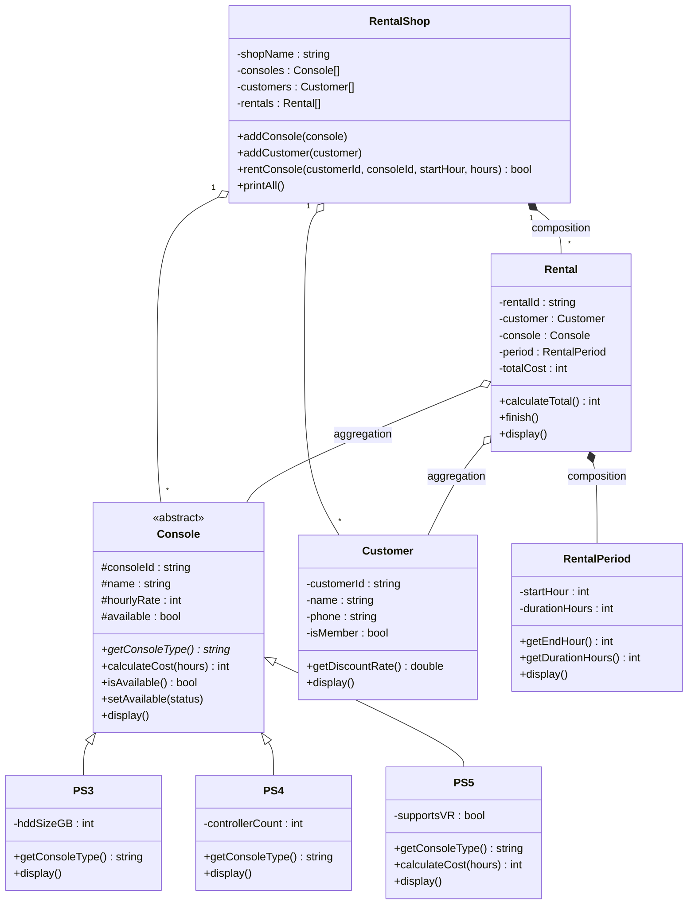

# TP3 DPBO - Rental PlayStation

## Janji

Saya [NAMA LENGKAP] dengan NIM [NIM] mengerjakan Tugas Praktikum 3 dalam mata kuliah Desain dan Pemrograman Berorientasi Objek untuk keberkahan-Nya maka saya tidak melakukan kecurangan seperti yang telah dispesifikasikan. Aamiin.

## Tentang Program

Program ini mensimulasikan rental PlayStation. Di dalamnya ada daftar konsol (PS3, PS4, PS5), data pelanggan, dan transaksi sewa lengkap dengan total biayanya. Pelanggan member dapat diskon 10%, dan PS5 yang punya VR kena biaya tambahan Rp 3.000 per jam. Program dibuat dalam tiga bahasa: C++, Python, dan Java (bonus).

## Desain Diagram Program



Keterangan panah: `<|--` inheritance, `*--` composition (diamond hitam), `o--` aggregation (diamond putih).

## Penjelasan Atribut dan Method

### Console (abstract, parent)
Kelas induk untuk semua konsol. Tidak bisa dibuat objeknya langsung karena punya method abstract.

| Atribut | Penjelasan |
|---|---|
| `consoleId` | Kode konsol, contoh `PS5-01` |
| `name` | Nama konsol |
| `hourlyRate` | Tarif sewa per jam (Rupiah) |
| `available` | `true` kalau konsol bisa disewa |

| Method | Penjelasan |
|---|---|
| `getConsoleType()` | Abstract. Mengembalikan jenis konsol, wajib dibuat di tiap child |
| `calculateCost(hours)` | Menghitung biaya sewa, yaitu `hourlyRate x hours`. Boleh di-override child |
| `isAvailable()` / `setAvailable()` | Cek / ubah status ketersediaan |
| `display()` | Menampilkan data umum konsol |

### PS3 (child dari Console)
| Atribut | Penjelasan |
|---|---|
| `hddSizeGB` | Kapasitas hard disk dalam GB |

Method: `getConsoleType()` mengembalikan `"PS3"`, `display()` ditambah info HDD.

### PS4 (child dari Console)
| Atribut | Penjelasan |
|---|---|
| `controllerCount` | Jumlah stik yang disediakan |

Method: `getConsoleType()` mengembalikan `"PS4"`, `display()` ditambah jumlah stik.

### PS5 (child dari Console)
| Atribut | Penjelasan |
|---|---|
| `supportsVR` | `true` kalau unit ini ada VR |

Method:
- `getConsoleType()` mengembalikan `"PS5"`.
- `calculateCost(hours)` di-override. Kalau `supportsVR` aktif, tarif per jam ditambah Rp 3.000.
- `display()` ditambah info VR.

### Customer
| Atribut | Penjelasan |
|---|---|
| `customerId` | Kode pelanggan, contoh `C001` |
| `name` | Nama pelanggan |
| `phone` | Nomor telepon |
| `isMember` | Status member |

| Method | Penjelasan |
|---|---|
| `getDiscountRate()` | Member dapat 10%, non-member 0% |
| `display()` | Menampilkan data pelanggan |

### RentalPeriod
Menyimpan waktu sewa.

| Atribut | Penjelasan |
|---|---|
| `startHour` | Jam mulai (0-23) |
| `durationHours` | Lama sewa dalam jam |

| Method | Penjelasan |
|---|---|
| `getEndHour()` | Jam selesai, yaitu `startHour + durationHours` |
| `getDurationHours()` | Mengambil lama sewa |
| `display()` | Menampilkan rentang waktu, contoh `14:00 - 17:00 (3 jam)` |

### Rental
Satu transaksi sewa.

| Atribut | Penjelasan |
|---|---|
| `rentalId` | Kode transaksi, contoh `R001` |
| `customer` | Referensi ke pelanggan yang menyewa |
| `console` | Referensi ke konsol yang disewa |
| `period` | Objek `RentalPeriod` |
| `totalCost` | Total biaya setelah diskon |

| Method | Penjelasan |
|---|---|
| `calculateTotal()` | `console.calculateCost(jam)` dikurangi diskon pelanggan |
| `finish()` | Menyelesaikan sewa, konsol jadi tersedia lagi |
| `display()` | Menampilkan detail transaksi |

### RentalShop
Kelas utama yang menyimpan dan mengatur semua data.

| Atribut | Penjelasan |
|---|---|
| `shopName` | Nama rental |
| `consoles` | Array berisi `Console` (campuran PS3, PS4, PS5) |
| `customers` | Array berisi `Customer` |
| `rentals` | Array berisi `Rental` |

| Method | Penjelasan |
|---|---|
| `addConsole(console)` | Tambah konsol ke array |
| `addCustomer(customer)` | Tambah pelanggan ke array |
| `rentConsole(customerId, consoleId, startHour, hours)` | Cari pelanggan dan konsol, cek konsol masih tersedia atau tidak, lalu buat `Rental` baru. Kalau konsol sedang disewa, transaksi ditolak |
| `printAll()` | Menampilkan semua konsol, pelanggan, dan transaksi |

Ada juga file `Utils` di tiap bahasa yang isinya fungsi bantu untuk memformat angka jadi Rupiah (`Rp 16.200`) dan jam (`09:00`). File ini bukan bagian dari desain kelas.

## Penjelasan Desain Program

### Hierarchical Inheritance
`Console` adalah satu superclass yang diwarisi tiga subclass sekaligus, yaitu `PS3`, `PS4`, dan `PS5`.

Hubungannya "is-a": PS5 adalah sebuah Console. Atribut dan method yang sama di semua konsol (`consoleId`, `name`, `hourlyRate`, `available`, `calculateCost()`, `display()`) cukup ditulis sekali di `Console`. Tiap child tinggal menambah yang membedakan dirinya: `hddSizeGB` untuk PS3, `controllerCount` untuk PS4, dan `supportsVR` untuk PS5.

`getConsoleType()` dibuat abstract supaya tiap child wajib mendefinisikannya sendiri. `PS5` juga meng-override `calculateCost()` untuk menambah biaya VR. Karena array menyimpan konsol sebagai tipe `Console`, saat `calculateCost()` dipanggil program otomatis memakai versi milik tipe aslinya (polimorfisme). Dari sisi tiap child ini tetap single inheritance.

Hierarchical dipilih karena cocok dengan temanya (satu induk, beberapa varian konsol) dan bisa dipakai di ketiga bahasa. Java tidak mendukung multiple inheritance antar class, jadi pilihan ini paling aman.

### Composition
Ada dua composition di program ini:

1. **Rental dan RentalPeriod.** `RentalPeriod` dibuat langsung di dalam constructor `Rental`. Periode sewa tidak ada artinya tanpa transaksinya, jadi kalau `Rental` hilang, `RentalPeriod` ikut hilang.
2. **RentalShop dan Rental.** Objek `Rental` dibuat oleh `RentalShop` di dalam method `rentConsole()` lalu disimpan di array `rentals`. Jadi transaksi dimiliki penuh oleh toko.

### Aggregation
- `Rental` hanya menyimpan referensi ke `Customer` dan `Console`. Dua objek itu tidak dibuat oleh `Rental` dan tetap ada walaupun transaksinya selesai.
- `RentalShop` juga hanya menyimpan referensi ke `Console` dan `Customer` yang dibuat dari luar (di `main`) lalu dimasukkan lewat `addConsole()` dan `addCustomer()`.

### Array of Object
`RentalShop` punya tiga array: `consoles`, `customers`, dan `rentals`. Di C++ memakai `vector`, di Python `list`, dan di Java `ArrayList`. Array `consoles` isinya campuran PS3, PS4, dan PS5.

### Ringkasan Hubungan
| Hubungan | Contoh | Jenis |
|---|---|---|
| PS5 adalah Console | `PS5` turunan `Console` | Inheritance (is-a) |
| Rental punya RentalPeriod | dibuat di constructor `Rental` | Composition (has-a) |
| RentalShop punya Rental | dibuat di `rentConsole()` | Composition (has-a) |
| Rental memakai Customer dan Console | hanya referensi | Aggregation |

## Penjelasan Alur Program

Alurnya sama untuk C++, Python, dan Java.

1. `main` membuat objek `RentalShop` bernama "PS Rental DPBO".
2. Dibuat data awal: 3 konsol (PS3, PS4, PS5 dengan VR) dan 2 pelanggan (Budi member, Sari non-member), lalu dimasukkan ke toko lewat `addConsole()` dan `addCustomer()`.
3. Dibuat 2 transaksi awal lewat `rentConsole()`. Di dalamnya toko mencari pelanggan dan konsol berdasarkan ID, mengecek konsol masih tersedia, membuat `Rental` baru (yang otomatis membuat `RentalPeriod` dan menghitung total biaya), lalu menandai konsol jadi tidak tersedia.
4. `printAll()` dipanggil untuk menampilkan data **sebelum** penambahan.
5. Ditambah data baru: 1 konsol (PS5 tanpa VR) dan 1 pelanggan (Dimas, member).
6. Dibuat transaksi baru untuk Dimas. Lalu dicoba satu transaksi lagi untuk konsol yang sedang disewa, dan program menolaknya dengan pesan `[GAGAL]`.
7. `printAll()` dipanggil lagi untuk menampilkan data **sesudah** penambahan.

Hitungan biaya di data contoh:

| Transaksi | Perhitungan | Total |
|---|---|---|
| R001: Budi, PS4, 3 jam | 6.000 x 3 = 18.000, diskon member 10% | Rp 16.200 |
| R002: Sari, PS5 VR, 2 jam | (10.000 + 3.000) x 2 = 26.000, tanpa diskon | Rp 26.000 |
| R003: Dimas, PS5 non-VR, 4 jam | 10.000 x 4 = 40.000, diskon member 10% | Rp 36.000 |

## Struktur Folder

```
.
├── CPP
│   ├── Program
│   └── Dokumentasi
├── Python
│   ├── Program
│   └── Dokumentasi
├── Java
│   ├── Program
│   └── Dokumentasi
└── README.md
```

## Cara Menjalankan

**C++** (compile `Main.cpp` saja, file lain ikut lewat `#include`)
```bash
cd CPP/Program
g++ Main.cpp -o Main
./Main
```
Di Windows: `g++ Main.cpp -o Main.exe` lalu `Main.exe`.

**Python**
```bash
cd Python/Program
python main.py
```

**Java**
```bash
cd Java/Program
javac *.java
java Main
```

## Dokumentasi

### C++


### Python

